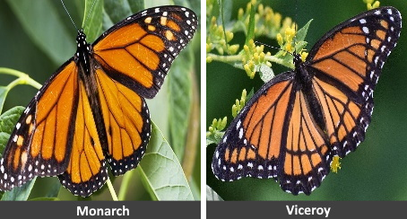
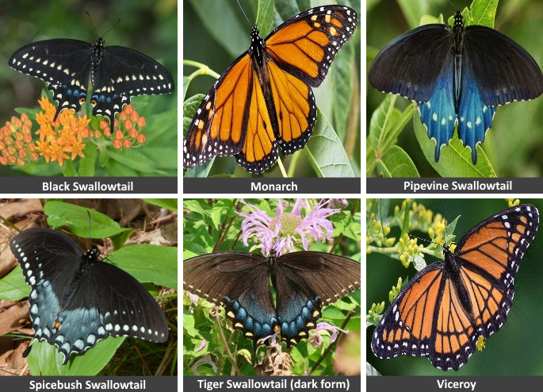

# The 2022 Dataset of Butterfly Mimics

[YOYMimics-2022-dataset.pdf](YOYMimics-2022-dataset.pdf)

This 2022 version of the dataset has two variations:

An abbreviated `tiny` dataset for image classification of just 2 species with an accompanying
 [tiny dataset document](tiny/2022-Dataset-of-Butterfly-Mimics--Tiny.pdf).

And, a full `data` version for classification of 6 butterfly species with its own accompanying [dataset document](data/2022-Dataset-of-Butterfly-Mimics.pdf).

## To Download the Dataset

The Github repository contains everything but the images in the dataset. They full dataset with images is hosted on Kaggle. Follow the link to download the complete dataset, https://www.kaggle.com/datasets/keithpinson/butterfly-mimics-2022.

## License

[CC BY-NC 4.0](LICENSE)
