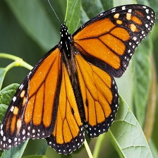
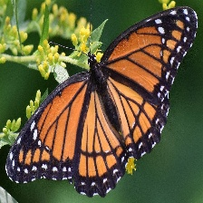
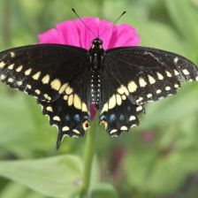
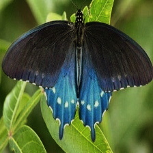
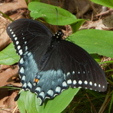
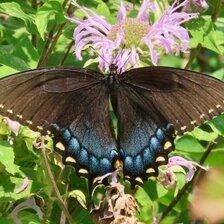

# The Yum or Yuck Dataset of Butterfly Mimics

This 2022 version of the dataset has two variations:

- An abbreviated `tiny` dataset for classification of just 2 species

<figure>

</figure>

- And, a full `data` version for classification of 6 butterfly species

<figure>

</figure>

<figure>

</figure>

